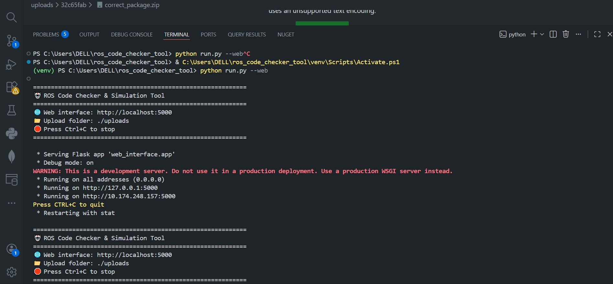
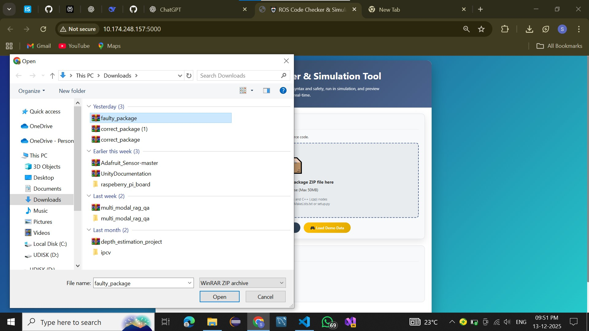
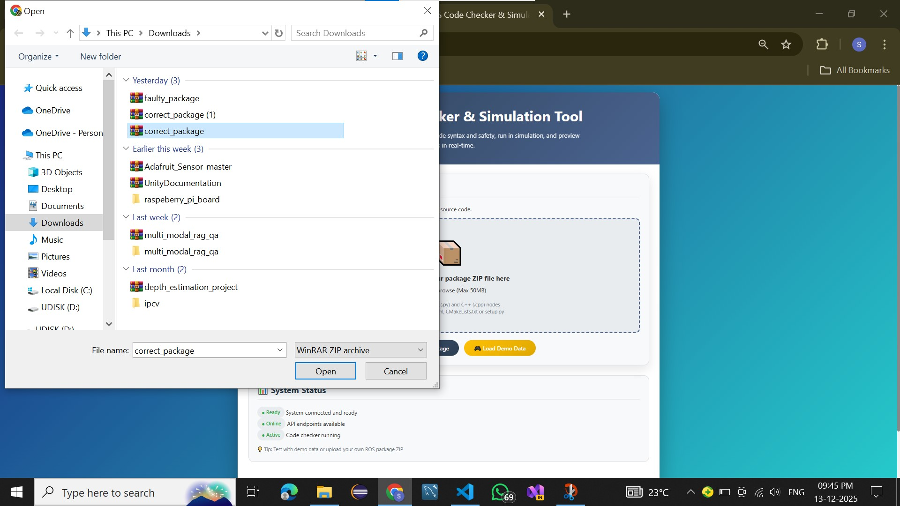
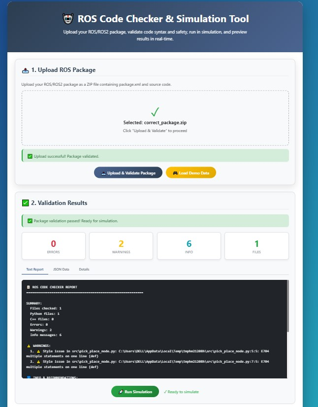
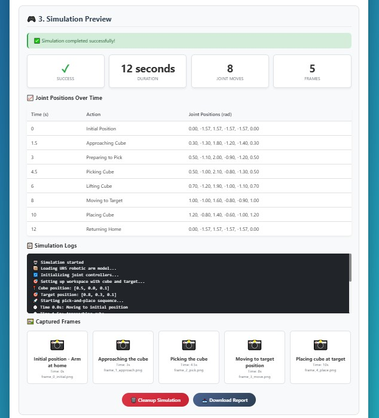
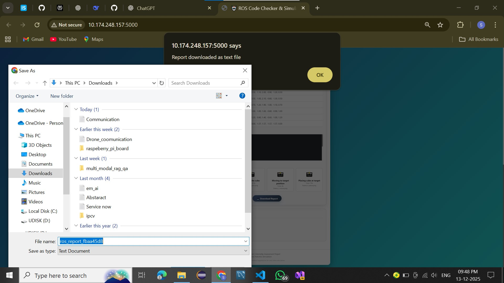
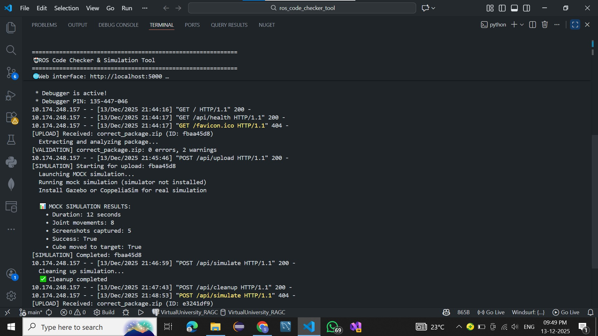

# ROS Code Checker & Simulation Preview Tool

A lightweight web-based tool that allows users to upload ROS (Robot Operating System) packages, analyze code quality, and preview a mock robotic arm simulation — without installing ROS locally.

---

## Project Preview

### Demo Video  
[▶ Click here to watch the demo video](your_demo_video_link_here)

### Screenshots  

#### Web Interface – Upload & Validation

#### Faulty Package – Validation Errors

#### Correct Package – Validation Passed

#### Simulation Preview – Pick and Place

#### Simulation Logs & Joint Movements

#### Captured Simulation Frames

#### Report Download

---

## Features

- **No ROS Installation Required**  
  Works on Windows, Linux, and macOS with Python 3.7+.

- **Static Code Analysis**  
  Detects syntax issues, structural errors, and common ROS mistakes.

- **Style Validation**  
  Python (flake8) and C++ formatting checks based on ROS guidelines.

- **Safety Rules Checker**  
  Detects:
  - Unsafe joint limits  
  - Infinite loops without sleep  
  - Missing `init_node`  
  - Incorrect publishers/subscribers  

- **Web Interface (Flask GUI)**  
  Upload ZIP packages, view reports, and preview simulation output.

- **Batch Processing**  
  Analyze full ROS packages or single files.

---

## Installation

1. Clone the repository
git clone https://github.com/yourusername/ros_code_checker_tool.git
cd ros_code_checker_tool

2. Create a virtual environment (recommended)
python -m venv venv

3. Activate virtual environment
Windows:
venv\Scripts\activate

Linux/Mac:
source venv/bin/activate

4. Install dependencies
pip install -r requirements.txt

5. Run the tool
python run.py --web

Once running, open your browser to:  
[http://localhost:5000](http://localhost:5000/)

---

## Architecture Diagram

            +---------------------------+
            |       Web Interface       |
            |       (Flask / HTML)      |
            +--------------+------------+
                           |
                           | Upload ZIP
                           v
            +---------------------------+
            |         Backend API       |
            |          (run.py)         |
            +--------------+------------+
                           |
                           v
    +------------------------------------------------+
    |                  Code Checker                  |
    |------------------------------------------------|
    | Syntax Check | Structure Check | Safety Rules  |
    | flake8/g++   | pkg.xml, CMake  | joint limits  |
    +------+-------+---------+-------+----------------+
           |                 |
           | Valid           | Errors / Warnings
           v                 v
 +------------------+      +----------------------+
 | Simulation Runner|      |    Report Generator  |
 |   (Mock UR5)     |      |   TXT + JSON Output  |
 +--------+---------+      +----------+-----------+
          |                           |
          | Frames + Logs             | Reports
          v                           v
 +-----------------------+    +--------------------------+
 |  Simulation Preview   |    |  report.txt / report.json|
 +-----------------------+    +--------------------------+

---

## Included Test Packages

### ✔ correct_package
A fully valid ROS package demonstrating:
- Proper ROS node structure
- Safe joint motion commands
- Valid publishers and subscribers
- Completes simulation without errors

### ❌ faulty_package
Shows common ROS mistakes including:
- Missing `init_node`
- Infinite loop without `rate.sleep()`
- Invalid joint values
- Broken ROS package structure

---

## Output Files

The tool generates:
- **report.txt** – Summary of all errors/warnings
- **report.json** – JSON-structured output for automation
- **Simulation logs** – Internal debug information
- **Simulation frames** – Visual preview of robot motion

---

## Folder Structure

ros_code_checker_tool/
│
├── backend/
│ ├── checker.py
│ ├── simulation.py
│ └── utils/
│
├── tests/
│ ├── correct_package/
│ └── faulty_package/
│
├── templates/
│ └── index.html
│
├── static/
│ └── styles.css
│
├── run.py
├── requirements.txt
└── README.md

---

## Roadmap

- [ ] Live ROS node graph visualization
- [ ] Plugin support for Gazebo/ROS2
- [ ] Real-time simulation rendering
- [ ] CI/CD integration for ROS codebases

---

## License

**MIT License** — free for personal, academic, and commercial use.

## Author

Developed by **Sunkeerth**  
*ROS Tools • Robotics Simulation • AI/ML Engineering*

